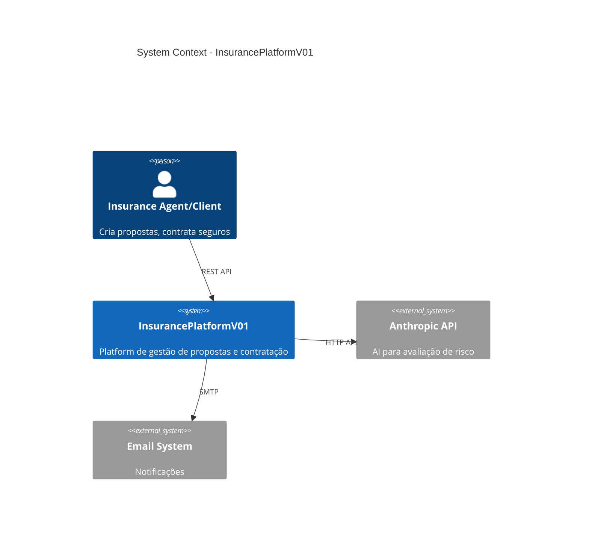
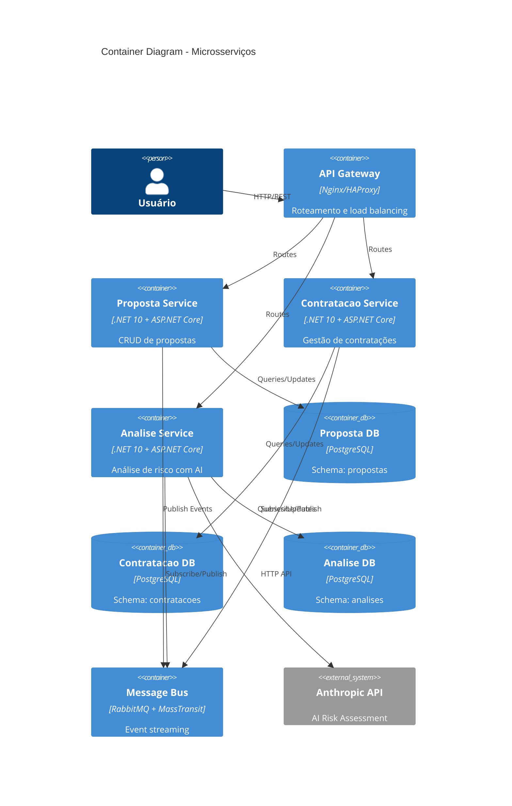
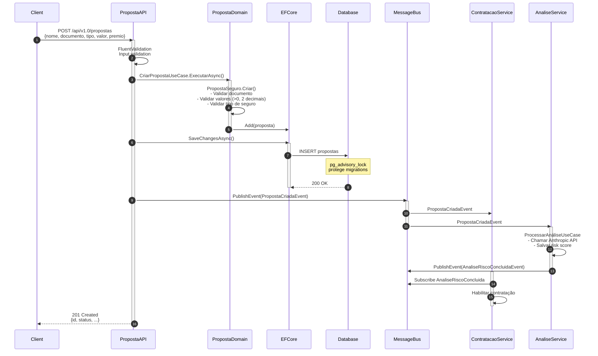
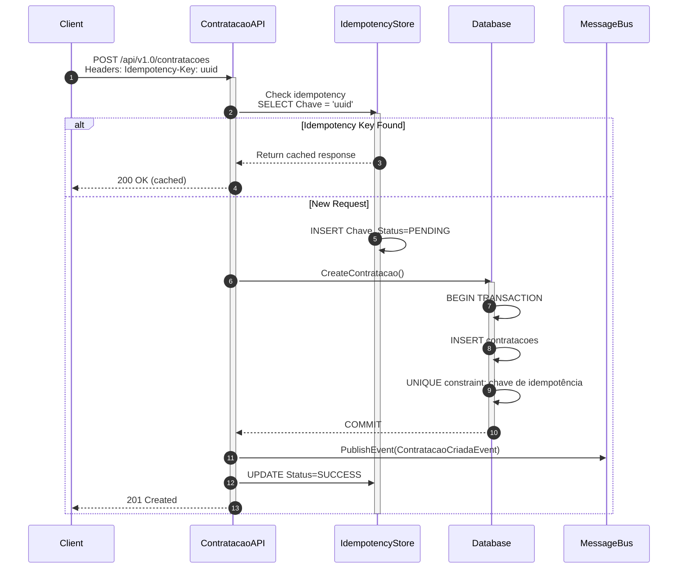

# 🏗️ Architecture Documentation

## Índice

- [System Context](#system-context)
- [Container Diagram](#container-diagram)
- [Component Diagram](#component-diagram)
- [Deployment Diagram](#deployment-diagram)
- [Data Flow](#data-flow)
- [Technology Stack](#technology-stack)

---

## System Context



---

## Container Diagram



---

## Component Diagram (Proposta Service)

```mermaid
C4Component
    title Component Diagram - Proposta Service
    
    Container(api, "Proposta.Api", "", "") {
        Component(controllers, "Controllers", "ASP.NET Core", "HTTP endpoints")
        Component(middleware, "Middleware", "ASP.NET Core", "Auth, logging, error handling")
    }
    
    Container(application, "Proposta.Application", "", "") {
        Component(usecases, "Use Cases", "C#", "CriarPropostaUseCase, AtualizarPropostaUseCase, DeletarPropostaUseCase")
        Component(validators, "Validators", "FluentValidation", "Input validation")
        Component(dtos, "DTOs", "C#", "CriarPropostaCommand, PropostaDto")
    }
    
    Container(domain, "Proposta.Domain", "", "") {
        Component(entities, "Entities", "C#", "PropostaSeguro (aggregate root)")
        Component(valueobjects, "Value Objects", "C#", "DocumentoIdentificacao, Monetario")
        Component(services, "Domain Services", "C#", "Business rule validation")
    }
    
    Container(infrastructure, "Proposta.Infrastructure", "", "") {
        Component(repository, "EF Core Repository", "Entity Framework", "Data access")
        Component(efconfig, "EF Configurations", "Entity Framework", "Entity mappings, migrations")
        Component(httpclient, "HTTP Adapter", "Polly", "Resilient HTTP calls")
        Component(eventpub, "Event Publisher", "MassTransit", "Publish domain events")
    }
    
    Component(db, "PostgreSQL DB", "Database", "proposta_db")
    Component(mq, "RabbitMQ", "Message Broker", "Event bus")
    
    Person(client, "Client")
    
    Rel(client, controllers, "HTTP")
    Rel(controllers, middleware, "")
    Rel(middleware, usecases, "")
    Rel(usecases, validators, "")
    Rel(validators, valueobjects, "")
    Rel(usecases, entities, "")
    Rel(entities, services, "")
    Rel(usecases, repository, "")
    Rel(repository, db, "SQL")
    Rel(usecases, eventpub, "")
    Rel(eventpub, mq, "AMQP")
    Rel(usecases, httpclient, "")
```

---

## Deployment Diagram

```mermaid
C4Deployment
    title Deployment Diagram - Production Setup
    
    Deployment_Node(internet, "Internet", "Internet") {
        Deployment_Node(lb, "Load Balancer", "Azure Load Balancer / AWS ALB") {
            Container(edge, "Reverse Proxy", "Nginx", "SSL termination")
        }
    }
    
    Deployment_Node(k8s, "Kubernetes Cluster", "AKS / EKS") {
        Deployment_Node(proposta_node, "Proposta Pod", "Node") {
            Container(proposta_api, "Proposta.Api", "Docker container", ":5080")
        }
        Deployment_Node(contratacao_node, "Contratacao Pod", "Node") {
            Container(contratacao_api, "Contratacao.Api", "Docker container", ":5081")
        }
        Deployment_Node(analise_node, "Analise Pod", "Node") {
            Container(analise_api, "Analise.Api", "Docker container", ":5082")
        }
    }
    
    Deployment_Node(data, "Data Layer", "Cloud") {
        Deployment_Node(db_cluster, "PostgreSQL Cluster", "Managed DB Service") {
            Container(db1, "proposta_db", "Primary")
            Container(db2, "contratacao_db", "Primary")
            Container(db3, "analise_db", "Primary")
        }
        Deployment_Node(mq_cluster, "RabbitMQ Cluster", "Managed Message Service") {
            Container(rabbitmq, "RabbitMQ", "HA setup")
        }
    }
    
    Rel(internet, edge, "HTTPS")
    Rel(edge, proposta_api, "HTTP")
    Rel(edge, contratacao_api, "HTTP")
    Rel(edge, analise_api, "HTTP")
    
    Rel(proposta_api, db1, "TCP 5432")
    Rel(contratacao_api, db2, "TCP 5432")
    Rel(analise_api, db3, "TCP 5432")
    
    Rel(proposta_api, rabbitmq, "AMQP")
    Rel(contratacao_api, rabbitmq, "AMQP")
    Rel(analise_api, rabbitmq, "AMQP")
```

---

## Data Flow

### Proposta Creation Flow



### Contratacao Creation Flow (with Idempotency)



---

## Technology Stack

### Runtime & Framework
- **.NET 10.0** — Latest LTS runtime
- **ASP.NET Core 10** — Web framework with built-in DI, health checks
- **C# 14** — Latest language features (records, init-only, pattern matching, nullable reference types)

### Data Access & ORM
- **Entity Framework Core 10** — Object-relational mapper
- **PostgreSQL 16** — Primary datastore (ACID, JSON, advisory locks)
- **EF Core Migrations** — Schema versioning with distributed coordination

### Resilience & Messaging
- **Polly** — Circuit-breaker, retry, timeout policies for HTTP & DB
- **MassTransit 8.5.10** — Event bus (Apache 2.0 licensed)
- **RabbitMQ 3.x** — Persistent message broker

### Quality & Testing
- **FluentValidation 11.10** — Declarative input validation
- **xUnit 2.9.3** — Unit testing framework
- **Testcontainers 4.15** — Real Postgres/RabbitMQ in integration tests
- **.NET Analyzers** — Code quality, architecture rules
- **StyleCop 1.2.0-beta** — Code style enforcement

### Observability
- **Serilog 3.1** — Structured logging (JSON output)
- **OpenTelemetry 1.18** — Distributed tracing & metrics (OTLP)

### DevOps & CI/CD
- **Docker** — Multi-stage container builds
- **GitHub Actions** — Automated CI pipeline
- **CodeQL** — Security scanning
- **Dependabot** — Automated dependency updates

---

## Architectural Patterns

### 1. Hexagonal Architecture (Ports & Adapters)

```
Domain Layer (Core business logic)
    ↓
Ports (Interfaces)
    ↓
Adapters (External integrations: DB, HTTP, MQ)
```

**Benefits:**
- Domain logic is independent of infrastructure
- Easy to test (mock adapters)
- Flexible to swap implementations

### 2. Domain-Driven Design (DDD)

- **Aggregates**: PropostaSeguro, ApoliceSeguro, AnaliseRisco (root entities)
- **Value Objects**: DocumentoIdentificacao, Monetario, Vigencia (immutable)
- **Bounded Contexts**: Proposta, Contratacao, Analise (independent domains)
- **Domain Events**: PropostaCriada, ContratacaoCriada, AnaliseRiscoConcluida

### 3. Clean Architecture Layers

```
┌─────────────────────────────────┐
│      API Layer (Controllers)     │  HTTP endpoints, versioning
├─────────────────────────────────┤
│   Application Layer (Use Cases)  │  Business workflows, validators
├─────────────────────────────────┤
│      Domain Layer (Core)         │  Entities, value objects, rules
├─────────────────────────────────┤
│  Infrastructure (Adapters)       │  DB, messaging, external APIs
└─────────────────────────────────┘
```

### 4. CQRS-lite Pattern

- **Queries**: Separate from domain, optimized for reading
- **Commands**: Modify state through use cases
- **No separate query DB**: Single source of truth in PostgreSQL

### 5. Outbox Pattern (Event Reliability)

```
Transaction 1: INSERT data + INSERT event into outbox
    ↓
Transaction 2: Poll outbox → Publish to RabbitMQ → Mark as sent
```

**Guarantees**: At-least-once delivery, no duplicate loss

### 6. Polly Resilience Policies

| Component | Policy | Config |
|-----------|--------|--------|
| **Database** | Retry | 5 attempts, 10s exponential backoff |
| **HTTP (Proposta)** | Circuit-breaker | Fail ratio: 50%, sampling: 30s |
| **HTTP (Anthropic AI)** | Circuit-breaker | Fail ratio: 50%, sampling: 60s |

---

## Security Layers

### 1. Authentication
- **JWT (HS256)**: Header-based token validation
- **Issuer/Audience validation**: Prevent token misuse

### 2. Authorization
- **Role-based policies**: usuario, analista, admin
- **Centralized definitions**: AuthorizationPolicies.cs
- **Attribute-based enforcement**: [Authorize(Policy = "...")]

### 3. Input Validation
- **FluentValidation rules** at API boundary
- **Domain validation** inside aggregates
- **Database constraints**: CHECK (valor >= 0), UNIQUE keys

### 4. Database Security
- **Separate database users**: _migrator (DDL), _app (DML only)
- **Row-level access**: Implicit via stored data (user_id filters)
- **Encrypted connections**: SSL/TLS to database

### 5. Migration Safety
- **Advisory locks**: `pg_advisory_lock(721_001)` prevents concurrent DDL
- **Idempotent migrations**: Safe to retry on failure
- **No production data in schema**: Migrations use backfill, never raw data

---

## Scalability Considerations

### Horizontal Scaling
- **Stateless APIs**: No session affinity required
- **Independent databases**: Sharding strategy can be added per service
- **Message-driven**: RabbitMQ allows N consumers per event

### Vertical Scaling
- **Connection pooling**: EF Core with Npgsql pooling
- **Async/await throughout**: No blocking threads
- **Circuit-breaker**: Prevents thundering herd

### Caching Opportunities (Future)
- **Query results**: Redis for frequently accessed proposals
- **Risk scores**: Cache Anthropic responses (expires in 24h)
- **JWT tokens**: Short-lived (1h), no long-term cache needed

---

## Deployment Strategies

### Development (Docker Compose)
```bash
docker compose up --build
```
- All services + databases in one local environment
- Migrations run automatically (pg_advisory_lock handles concurrency)

### Staging/Production (Kubernetes)
```bash
kubectl apply -f k8s/proposta.yaml
kubectl apply -f k8s/contratacao.yaml
kubectl apply -f k8s/analise.yaml
```
- Each service as a separate deployment
- RabbitMQ and PostgreSQL as managed services (AKS, EKS)
- CI/CD via GitHub Actions → Docker Hub → Kubernetes

---

## References

- [Hexagonal Architecture](https://en.wikipedia.org/wiki/Hexagonal_architecture_(software))
- [Domain-Driven Design by Eric Evans](https://www.domainlanguage.com/ddd/)
- [Clean Architecture by Robert C. Martin](https://blog.cleancoder.com/uncle-bob/2012/08/13/the-clean-architecture.html)
- [MassTransit Documentation](https://masstransit.io/)
- [EF Core Best Practices](https://docs.microsoft.com/en-us/ef/core/performance/)
