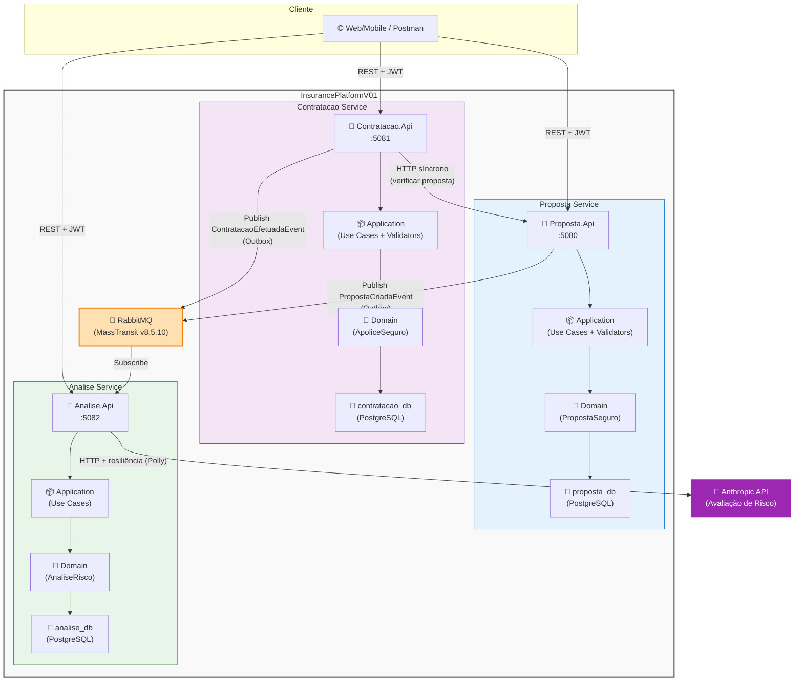
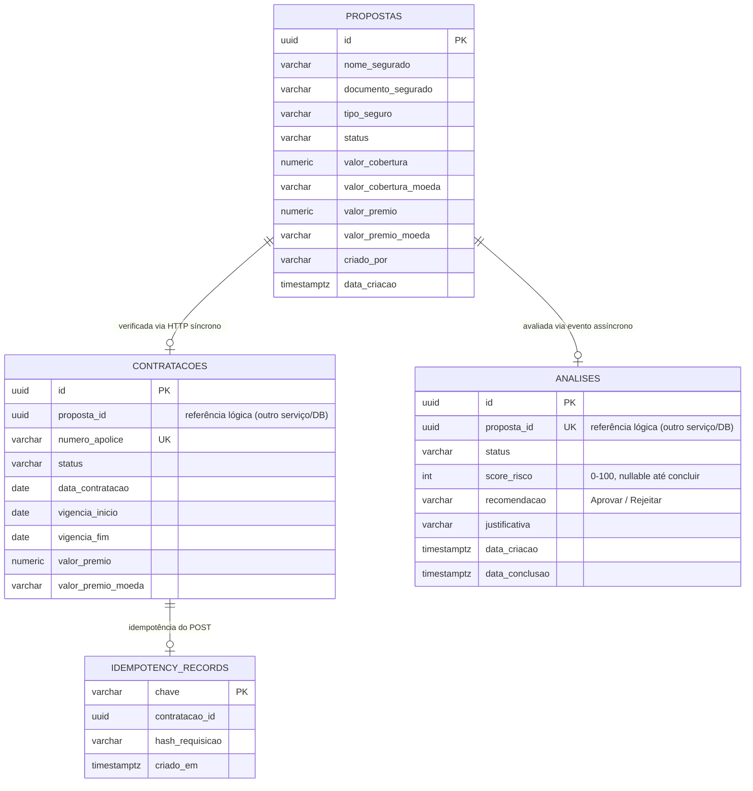

# 🏢 InsurancePlatformV01

[](https://github.com/marcelohori/InsurancePlatformV01/actions)
[](https://github.com/marcelohori/InsurancePlatformV01/security)
[](https://dotnet.microsoft.com/)
[](https://en.wikipedia.org/wiki/Hexagonal_architecture_(software))
[](LICENSE)

**Uma plataforma de gestão de propostas e contratação de seguros construída com .NET 10, seguindo Arquitetura Hexagonal, DDD e Clean Architecture.**

> Projeto de referência demonstrando melhores práticas em design de microsserviços, segurança, resiliência e DevOps.

---

## 📋 Índice

- [📖 Introdução](#-introdução)
- [🛠️ Tecnologias](#️-tecnologias)
- [📚 Documentação](#-documentação)
- [🎯 Visão Geral](#-visão-geral)
- [🏗️ Arquitetura do Sistema](#️-arquitetura-do-sistema)
- [🔄 Fluxo de Funcionamento](#-fluxo-de-funcionamento)
- [📦 Estrutura do Projeto](#-estrutura-do-projeto)
- [🧩 Camada, Subcamada e Responsabilidade](#-camada-subcamada-e-responsabilidade)
- [🚀 Como Executar](#-como-executar)
- [🔌 Endpoints e Acessos](#-endpoints-e-acessos)
- [🗄️ Script SQL](#️-script-sql)
- [🧪 Testes](#-testes)
- [🤖 IA](#-ia)
- [🔒 Segurança & Qualidade](#-segurança--qualidade)
- [📊 CI/CD Pipeline](#-cicd-pipeline)
- [🤝 Contribuindo](#-contribuindo)

---

## 📖 Introdução

InsurancePlatformV01 é uma plataforma de gestão de propostas e contratação de seguros, construída como **3 microsserviços independentes** (`Proposta`, `Contratacao`, `Analise`) que se comunicam via **REST síncrono** (verificação de proposta antes de contratar) e **eventos assíncronos** (avaliação de risco), cada um com sua própria base de dados PostgreSQL (*polyglot persistence*, um banco por serviço).

O projeto foi desenvolvido como referência de boas práticas em **.NET 10**, aplicando **Arquitetura Hexagonal (Ports & Adapters)**, **Domain-Driven Design** e **Clean Architecture**, com foco em segurança (JWT + RBAC), resiliência (retry/circuit-breaker/timeout via Polly), observabilidade (Serilog + OpenTelemetry) e uma suíte de **128 testes automatizados** (unitários, integração com Testcontainers e regras de arquitetura).

### Principais Funcionalidades

| Funcionalidade | Descrição |
|---|---|
| **Gestão de Propostas** | CRUD completo de propostas de seguro (Auto, Vida, Residencial, Saúde), com controle de posse (usuário só vê/edita as próprias) |
| **Avaliação de Risco com IA** | Toda proposta criada dispara, de forma assíncrona, uma avaliação de risco via **Anthropic API** (score 0-100, recomendação e justificativa) |
| **Contratação de Apólices** | Conversão de uma proposta **aprovada** em apólice, com verificação síncrona da proposta e suporte a idempotência (`Idempotency-Key`) |
| **Autenticação e Autorização** | JWT Bearer + políticas baseadas em papéis (`usuario`, `analista`, `admin`) |
| **Mensageria Confiável** | RabbitMQ + MassTransit com *Transactional Outbox Pattern* (garantia at-least-once) |
| **Observabilidade** | Logs estruturados (Serilog) e tracing/métricas distribuídos (OpenTelemetry/OTLP) |
| **Health Checks** | Liveness e readiness por serviço, validando conexão com Postgres e RabbitMQ |

### Características Técnicas

| Característica | Descrição |
|---|---|
| **3 Microsserviços** | Proposta, Contratacao, Analise — cada um independente, com seu próprio banco |
| **Event-Driven** | RabbitMQ + MassTransit para comunicação assíncrona (Outbox Pattern) |
| **Banco por Serviço** | PostgreSQL isolado por microsserviço |
| **API REST** | Versionamento explícito via `Asp.Versioning` (v1.0) |
| **Segurança** | JWT + Role-based Authorization + Input Validation (FluentValidation) |
| **Resiliência** | Circuit-breaker, retry, timeout policies via Polly (chamadas HTTP e Anthropic API) |
| **Testes** | 128 testes (unit + integration com Testcontainers + regras de arquitetura) |
| **DevOps Ready** | Docker Compose, GitHub Actions, Health Checks |

---

## 🛠️ Tecnologias

Todas as versões abaixo são as **efetivamente fixadas** em [`Directory.Packages.props`](Directory.Packages.props) (Central Package Management).

### Core Framework

| Tecnologia | Versão |
|---|---|
| .NET / C# | **.NET 10.0** |
| ASP.NET Core | 10.0 (Web API, DI, Health Checks) |
| Entity Framework Core | **10.0.12** |
| Npgsql.EntityFrameworkCore.PostgreSQL | **10.0.3** |
| Asp.Versioning.Mvc / .ApiExplorer | **8.1.0** |
| Microsoft.AspNetCore.Authentication.JwtBearer | **10.0.11** |
| Microsoft.AspNetCore.OpenApi | **10.0.11** |
| Swashbuckle.AspNetCore.SwaggerUI | **10.2.3** (UI apenas — o documento OpenAPI continua gerado por `Microsoft.AspNetCore.OpenApi`) |

### Banco de Dados

| Tecnologia | Versão |
|---|---|
| PostgreSQL | **16** (imagem `postgres:16-alpine`) |
| EF Core Migrations | Versionamento de schema, roles separados por serviço (`*_migrator` / `*_app`) |

### Mensageria

| Tecnologia | Versão |
|---|---|
| MassTransit / MassTransit.RabbitMQ / MassTransit.EntityFrameworkCore | **8.5.10** (pinned — v9 exige licença comercial) |
| RabbitMQ | **3-management-alpine** |

### Validação e Qualidade de Código

| Tecnologia | Versão |
|---|---|
| FluentValidation | **11.10.0** |
| FluentValidation.DependencyInjectionExtensions | **11.10.0** |
| StyleCop.Analyzers | 1.2.0-beta.556 |
| .NET Analyzers | Built-in, `TreatWarningsAsErrors=true` |

### Resiliência & Observabilidade

| Tecnologia | Versão |
|---|---|
| Microsoft.Extensions.Http.Resilience (Polly) | **9.10.0** |
| Serilog.AspNetCore | **9.0.0** |
| OpenTelemetry (Hosting/AspNetCore/Http/OTLP Exporter) | **1.18.0** |
| AspNetCore.HealthChecks.NpgSql / .Rabbitmq | **9.0.0** |

### Testes

| Tecnologia | Versão |
|---|---|
| xUnit | **2.9.3** |
| xunit.runner.visualstudio | 2.8.2 |
| Microsoft.AspNetCore.Mvc.Testing | **10.0.11** |
| Testcontainers.PostgreSql / .RabbitMq | **4.15.0** |
| WireMock.Net | **2.15.0** |
| NetArchTest.Rules | 1.3.2 |
| coverlet.collector | 6.0.4 |

### IA

| Tecnologia | Versão |
|---|---|
| Anthropic Messages API | `2023-06-01` (modelo padrão: `claude-haiku-4-5-20251001`, configurável) |

### DevOps

| Tecnologia | Versão |
|---|---|
| Docker / Docker Compose | Multi-stage builds, non-root execution, resource limits |
| GitHub Actions | Pipeline de CI/CD (build, testes, CodeQL, build de imagens) |
| CodeQL | Security scanning estático |

---

## 📚 Documentação

| Documento | Descrição |
|---|---|
| [📜 Histórico (CHANGELOG.md)](CHANGELOG.md) | Linha do tempo de evolução do schema e das principais entregas |
| [📮 Postman Collection](docs/postman/InsurancePlatformV01.postman_collection.json) | Coleção com todas as requisições dos 3 serviços prontas para importar |
| [🗄️ Scripts SQL](docs/sql/) | Scripts DDL idempotentes gerados via `dotnet ef migrations script` para as 3 bases |
| [🏗️ ARCHITECTURE.md](ARCHITECTURE.md) | Diagramas C4 completos, padrões de resiliência e estratégias de deployment |
| [🔒 SECURITY.md](SECURITY.md) | Política de segurança e como reportar vulnerabilidades |
| [🤝 CONTRIBUTION.md](CONTRIBUTION.md) | Guia para contribuidores |
| [📦 DEPENDENCY_POLICY.md](DEPENDENCY_POLICY.md) | Política de atualização de dependências |
| [🔍 LANGUAGE_ANALYSIS_POLICY.md](LANGUAGE_ANALYSIS_POLICY.md) | Versão de C#, analyzers e regras de qualidade |

---

## 🎯 Visão Geral

| Serviço | Responsabilidade | Porta (host) |
|---|---|---|
| **Proposta.Api** | CRUD de propostas de seguro; publica `PropostaCriadaEvent` ao criar uma proposta | `5080` |
| **Contratacao.Api** | Converte uma proposta **aprovada** em apólice; verifica a proposta via HTTP e publica `ContratacaoEfetuadaEvent` | `5081` |
| **Analise.Api** | Consome `PropostaCriadaEvent` e realiza avaliação de risco assistida por IA (Anthropic) | `5082` |
| **PostgreSQL** | Uma base por serviço (`proposta_db`, `contratacao_db`, `analise_db`) — acesso apenas interno à rede Docker | `5432` (interno) |
| **RabbitMQ** | Message broker (AMQP + Management UI) usado pelo MassTransit — acesso apenas interno à rede Docker | `5672` / `15672` (interno) |

> Os três serviços de API expõem ainda um job de migração dedicado (`*.Migrator`), que roda uma única vez para aplicar o schema com um usuário de banco com permissão de DDL, separado do usuário de runtime da API (permissão apenas de DML) — ver [Segurança & Qualidade](#-segurança--qualidade).

---

## 🏗️ Arquitetura do Sistema



> Mais diagramas (System Context C4, Deployment, Clean Architecture Layers, Component Diagram) estão em [ARCHITECTURE.md](ARCHITECTURE.md).

### 📐 Padrões Utilizados

- **Arquitetura Hexagonal**: separação entre core de negócio (Domain) e infraestrutura (Ports & Adapters)
- **Domain-Driven Design**: linguagem ubíqua, value objects (`Monetario`, `Vigencia`, `DocumentoIdentificacao`)
- **Clean Architecture**: dependências sempre apontam para dentro (Domain não depende de nada)
- **Outbox Pattern**: garantia de entrega *at-least-once* dos eventos (`OutboxState`/`OutboxMessage` do MassTransit, na mesma transação da escrita de domínio)
- **Idempotency Key**: `POST /contratacoes` é seguro para retry via header `Idempotency-Key` (UUID v4)

---

## 🔄 Fluxo de Funcionamento

Passo a passo real (validado no código dos três serviços) de como uma proposta se torna uma apólice:

1. **Criação da proposta** — o cliente autentica-se com um JWT (papel `usuario`, `analista` ou `admin`) e chama `POST /api/v1.0/propostas` no **Proposta.Api**. O `FluentValidationFilter` valida o payload (`CriarPropostaCommand`), o Use Case cria a entidade `PropostaSeguro` com status **`EmAnalise`** e grava, na mesma transação, o evento `PropostaCriadaEvent` na tabela de Outbox.
2. **Publicação assíncrona** — o *Outbox Delivery Service* do MassTransit publica `PropostaCriadaEvent` no RabbitMQ de forma assíncrona, desacoplada da resposta HTTP já devolvida ao cliente (201 Created).
3. **Avaliação de risco por IA** — o **Analise.Api** consome o evento (`PropostaCriadaEventConsumer`), cria um registro `AnaliseRisco` (status `EmProcessamento`) e chama a **Anthropic API** através de um `HttpClient` com política de resiliência (retry, timeout, circuit-breaker via Polly). A resposta é validada (score 0-100, recomendação `Aprovar`/`Rejeitar`, justificativa) e persistida (status `Concluida` ou `Falha` em caso de erro do provedor).
4. **Consulta da análise** — o cliente pode consultar o resultado a qualquer momento em `GET /api/v1.0/propostas/{propostaId}/analise` no **Analise.Api**. A IA é **consultiva**: ela não altera o status da proposta.
5. **Decisão humana** — um usuário com papel `analista` ou `admin` chama `PUT /api/v1.0/propostas/{id}` no **Proposta.Api** para mudar o status da proposta para `Aprovada` (ou `Rejeitada`), tipicamente usando a recomendação da IA como subsídio.
6. **Contratação** — com a proposta `Aprovada`, um `analista`/`admin` chama `POST /api/v1.0/contratacoes` no **Contratacao.Api**, opcionalmente com o header `Idempotency-Key` (UUID v4) para tornar a chamada segura a retries. O Use Case:
   - verifica a chave de idempotência (se enviada) — se já usada com o mesmo payload, retorna a apólice já criada; se usada com payload diferente, retorna `409 Conflict`;
   - chama **sincronamente**, via HTTP resiliente, o **Proposta.Api** (`IPropostaVerificationPort`) para confirmar que a proposta existe e está `Aprovada` — senão, `404`/`409`;
   - cria a entidade `ApoliceSeguro` e publica `ContratacaoEfetuadaEvent` no barramento (disponível para consumidores futuros, ex.: faturamento/notificações).

### Aderência à Arquitetura Hexagonal

Cada serviço segue rigorosamente **Ports & Adapters**: o `Domain` nunca depende de `Application` ou `Infrastructure` (validado automaticamente pelos `Architecture.Tests` com `NetArchTest.Rules`); a `Application` define **portas** (interfaces) que a `Infrastructure` implementa como **adaptadores**; e a `Api` é o adaptador de entrada (driving adapter) que aciona os casos de uso.

| Camada do Projeto | Papel na Arquitetura Hexagonal | Conteúdo (exemplos reais) |
|---|---|---|
| `*.Domain` | **Núcleo de negócio** (hexágono) — entidades, value objects, invariantes | `PropostaSeguro`, `ApoliceSeguro`, `AnaliseRisco`, `Monetario`, `Vigencia`, `DocumentoIdentificacao` |
| `*.Application` (Use Cases) | **Portas de entrada** (*driving ports*) — casos de uso que orquestram o domínio | `CriarPropostaUseCase`, `CriarContratacaoUseCase`, `ConsultarAnalisePorPropostaUseCase` |
| `*.Application/Ports` | **Portas de saída** (*driven ports*) — interfaces que o domínio/aplicação precisam, sem saber como são implementadas | `IPropostaRepository`, `IContratacaoRepository`, `IEventPublisher`, `IUnitOfWork`, `IRiskAssessmentPort`, `IPropostaVerificationPort`, `IIdempotencyStore` |
| `*.Infrastructure` | **Adaptadores de saída** (*driven adapters*) — implementações concretas das portas de saída | Repositórios EF Core, `HttpPropostaVerificationAdapter`, `AnthropicRiskAssessmentAdapter`, publisher MassTransit |
| `*.Api` (Controllers) | **Adaptadores de entrada** (*driving adapters*) — traduzem HTTP em chamadas aos Use Cases | `PropostasController`, `ContratacoesController`, `AnalisesController` |
| `*.Api` (Filters/Middleware) | **Adaptadores de entrada transversais** — cross-cutting concerns na borda do hexágono | `FluentValidationFilter`, `DomainExceptionHandler`, autenticação JWT Bearer |

---

## 📦 Estrutura do Projeto

```mermaid
graph TD
    Root["InsurancePlatformV01/"]

    Root --> Src["src/"]
    Root --> Tests["tests/"]
    Root --> Docs["docs/"]
    Root --> Gh[".github/workflows/"]

    Src --> BB["BuildingBlocks.Contracts/<br/>(Events, Authorization Policies)"]
    Src --> P["Proposta/"]
    Src --> C["Contratacao/"]
    Src --> A["Analise/"]

    P --> P1["Proposta.Domain"]
    P --> P2["Proposta.Application"]
    P --> P3["Proposta.Infrastructure"]
    P --> P4["Proposta.Api"]
    P --> P5["Proposta.Migrator"]

    C --> C1["Contratacao.Domain"]
    C --> C2["Contratacao.Application"]
    C --> C3["Contratacao.Infrastructure"]
    C --> C4["Contratacao.Api"]
    C --> C5["Contratacao.Migrator"]

    A --> A1["Analise.Domain"]
    A --> A2["Analise.Application"]
    A --> A3["Analise.Infrastructure"]
    A --> A4["Analise.Api"]
    A --> A5["Analise.Migrator"]

    Tests --> T1["Proposta.UnitTests / .IntegrationTests"]
    Tests --> T2["Contratacao.UnitTests / .IntegrationTests"]
    Tests --> T3["Analise.UnitTests / .IntegrationTests"]
    Tests --> T4["Architecture.Tests"]

    Docs --> D1["sql/ (scripts DDL)"]
    Docs --> D2["postman/ (collection)"]

    style Root fill:#ECEFF1,stroke:#37474F,stroke-width:2px
    style Src fill:#E3F2FD,stroke:#1976D2
    style Tests fill:#FFF3E0,stroke:#F57C00
    style Docs fill:#E8F5E9,stroke:#388E3C
```



Cada serviço (`Proposta`, `Contratacao`, `Analise`) segue a mesma estrutura interna de 4 camadas + 1 job de migração — ver detalhamento na seção seguinte.

---

## 🧩 Camada, Subcamada e Responsabilidade

| Camada | Subcamada | Responsabilidade |
|---|---|---|
| **Domain** | Proposta.Domain | Entidade `PropostaSeguro`, enums `StatusProposta`/`TipoSeguro`, value objects (`Monetario`, `DocumentoIdentificacao`) |
| **Domain** | Contratacao.Domain | Entidade `ApoliceSeguro`, value objects (`Monetario`, `Vigencia`) |
| **Domain** | Analise.Domain | Entidade `AnaliseRisco`, enums `StatusAnalise`/`Recomendacao` |
| **Application** | UseCases | Orquestração de casos de uso (`CriarPropostaUseCase`, `AtualizarPropostaUseCase`, `DeletarPropostaUseCase`, `ListarPropostasUseCase`, `ObterPropostaPorIdUseCase`, e equivalentes em Contratacao/Analise) |
| **Application** | Validators | Regras de validação de entrada declaradas com FluentValidation (`CriarPropostaCommandValidator`, `CriarContratacaoRequestValidator`, etc.) |
| **Application** | Ports | Contratos (interfaces) que a Infrastructure implementa (`IPropostaRepository`, `IEventPublisher`, `IRiskAssessmentPort`, ...) |
| **Application** | Dtos/Contracts | Objetos de transporte de dados e comandos (`CriarPropostaCommand`, `PropostaDto`, `AnaliseDto`, ...) |
| **Infrastructure** | Persistence | `DbContext` do EF Core, configurações de mapeamento, migrations |
| **Infrastructure** | Messaging | Publisher de eventos e consumers MassTransit (ex.: `PropostaCriadaEventConsumer`) |
| **Infrastructure** | Http | Adaptadores HTTP resilientes (`HttpPropostaVerificationAdapter`) |
| **Infrastructure** | Ai | Adaptador da API da Anthropic (`AnthropicRiskAssessmentAdapter`) |
| **Infrastructure** | DependencyInjection | Registro de serviços (`AddPropostaInfrastructure`, etc.) |
| **Api** | Controllers | Endpoints HTTP (`PropostasController`, `ContratacoesController`, `AnalisesController`) |
| **Api** | Filters | `FluentValidationFilter` (validação automática de todo `ActionArgument` com validator registrado) |
| **Api** | Middleware | `DomainExceptionHandler` (mapeia exceções de domínio para `ProblemDetails`/status HTTP) |
| **Migrator** | — | Aplicativo console que roda `Database.MigrateAsync()` com o usuário `*_migrator` (permissão de DDL), separado do usuário de runtime da API |

---

## 🚀 Como Executar

### Pré-requisitos
- **.NET 10 SDK** ou superior
- **Docker & Docker Compose** (recomendado)
- **Git**

### Com Docker (Recomendado)

```bash
# 1. Clone o repositório
git clone https://github.com/marcelohori/InsurancePlatformV01.git
cd InsurancePlatformV01

# 2. Configure variáveis de ambiente (copie de exemplo)
cp .env.example .env
# Edite .env com seus valores sensíveis - troque JWT_SIGNING_KEY por uma string aleatória de
# 32+ caracteres (as APIs recusam subir com o placeholder do .env.example de propósito) e,
# se for usar a avaliação de risco por IA, defina ANTHROPIC_API_KEY.

# 3. Suba o ambiente completo (Postgres, RabbitMQ, migrators e as 3 APIs)
docker compose up --build

# 4. Health check de cada serviço
curl http://localhost:5080/health/live   # Proposta
curl http://localhost:5081/health/live   # Contratacao
curl http://localhost:5082/health/live   # Analise
```

> Em Docker, os serviços rodam em `ASPNETCORE_ENVIRONMENT=Production` por padrão (nenhuma variável de ambiente a define diferente no `docker-compose.yml`), então o Swagger UI e o documento OpenAPI cru (`/openapi/v1.json`) só ficam disponíveis rodando localmente com `dotnet run` (perfil `Development`) — ver [Endpoints e Acessos](#-endpoints-e-acessos).

### Sem Docker (Desenvolvimento Local)

Os serviços `*.Migrator` e `*.Api` **não têm connection string default em `appsettings.json`** — leem tudo de variáveis de ambiente (`ConnectionStrings__*`, `RabbitMq__*`, `Jwt__*`), exatamente como em produção. Além disso, o `docker-compose.yml` deixa as portas do Postgres/RabbitMQ **fechadas por padrão** (só acessíveis de dentro da rede Docker) — então rodar as APIs fora do Docker exige um passo a mais para expor essas portas ao host.

```powershell
# 1. Suba só a infraestrutura (Postgres + RabbitMQ), com um overlay que expõe as portas ao host
docker compose -f docker-compose.yml -f docker-compose.local.yml up -d postgres rabbitmq

# 2. Restaure e compile
dotnet restore InsurancePlatformV01.slnx
dotnet build InsurancePlatformV01.slnx

# 3. Aplique as migrations de cada serviço, usando o role "*_migrator" (tem permissão de DDL) -
#    as senhas abaixo são os defaults de docker-compose.yml/.env.example; ajuste se você
#    customizou *_MIGRATOR_PASSWORD no seu .env
$env:ConnectionStrings__PropostaDbMigrator = "Host=localhost;Port=5432;Database=proposta_db;Username=proposta_migrator;Password=proposta_migrator"
dotnet run --project src/Proposta/Proposta.Migrator

$env:ConnectionStrings__ContratacaoDbMigrator = "Host=localhost;Port=5432;Database=contratacao_db;Username=contratacao_migrator;Password=contratacao_migrator"
dotnet run --project src/Contratacao/Contratacao.Migrator

$env:ConnectionStrings__AnaliseDbMigrator = "Host=localhost;Port=5432;Database=analise_db;Username=analise_migrator;Password=analise_migrator"
dotnet run --project src/Analise/Analise.Migrator

# 4. Rode cada API em um terminal separado, com o role "*_app" (só DML) - ASPNETCORE_URLS
#    alinha a porta com a usada no resto deste README/Postman collection (5080/5081/5082).
#    RunMigrationsOnStartup=false é obrigatório aqui: o default "true" do
#    appsettings.Development.json faz a API tentar `CREATE TABLE IF NOT EXISTS
#    "__EFMigrationsHistory"` no boot (é DDL, mesmo a tabela já existindo) - e o role "*_app"
#    não tem permissão de DDL, então a API derruba com "permission denied for schema public".
#    Como o Migrator já aplicou tudo no passo 3, isso é seguro de desligar aqui.
$env:RunMigrationsOnStartup = "false"
$env:ConnectionStrings__PropostaDb = "Host=localhost;Port=5432;Database=proposta_db;Username=proposta_app;Password=proposta_app"
$env:RabbitMq__Host = "localhost"
$env:RabbitMq__Username = "insurance"
$env:RabbitMq__Password = "insurance"
$env:Jwt__Issuer = "InsurancePlatformV01"
$env:Jwt__Audience = "InsurancePlatformV01"
$env:Jwt__SigningKey = "local-dev-signing-key-change-me-32-bytes-minimum"
$env:ASPNETCORE_URLS = "http://localhost:5080"
dotnet run --project src/Proposta/Proposta.Api
# repita o passo 4 para Contratacao.Api (porta 5081, ConnectionStrings__ContratacaoDb, role
# contratacao_app, mais PropostaApi__BaseUrl="http://localhost:5080") e Analise.Api (porta 5082,
# ConnectionStrings__AnaliseDb, role analise_app, mais Anthropic__Model) em terminais separados.
```

> **Atenção ao `Jwt__SigningKey`**: o valor `development-only-signing-key-change-me-32-bytes-min` do `.env.example` é rejeitado de propósito pelo `Program.cs` de cada API (é o próprio placeholder que o guard de startup bloqueia) — troque-o por qualquer string com 32+ caracteres antes de rodar fora do Docker Compose (o `docker-compose.yml` já usa esse mesmo default, então isso vale também para `docker compose up`).
>
> Fluxo validado de ponta a ponta com os três serviços rodando simultaneamente desta forma: `POST /api/dev/auth/token` → `POST /propostas` → evento `PropostaCriadaEvent` consumido pelo Analise.Api (via Outbox/RabbitMQ) → `PUT /propostas/{id}` (Aprovada) → `POST /contratacoes` (verifica a proposta via HTTP síncrono no Proposta.Api) → apólice criada.
>
> **Atalho mais rápido (sem separação de roles)**: `appsettings.Development.json` já tem `RunMigrationsOnStartup=true`, então apontar `ConnectionStrings__PropostaDb` direto para o usuário `postgres` (superuser) e rodar só `dotnet run --project src/Proposta/Proposta.Api` também aplica as migrations automaticamente no boot — mais rápido para iterar, mas abre mão do isolamento DDL/DML entre migrator e app descrito acima.
>
> **`docker-compose.local.yml`** é um overlay *opt-in* (só é aplicado quando referenciado explicitamente com `-f`) — o `docker compose up --build` "normal" (seção anterior) nunca expõe essas portas, mantendo o comportamento seguro por padrão.

### Configuração de Ambiente

Variáveis importantes em `.env` (usadas pelo `docker-compose.yml`):

```bash
# Database
POSTGRES_USER=postgres
POSTGRES_PASSWORD=postgres_pw_change_me

# RabbitMQ
RABBITMQ_USER=insurance
RABBITMQ_PASSWORD=insurance_pw_change_me

# JWT (compartilhado pelos 3 serviços)
JWT_ISSUER=InsurancePlatformV01
JWT_AUDIENCE=InsurancePlatformV01
JWT_SIGNING_KEY=your-256bit-key-at-least-32-bytes-minimum

# IA (Anthropic) — usado apenas pelo Analise.Api
ANTHROPIC_API_KEY=sk-ant-...
ANTHROPIC_MODEL=claude-haiku-4-5-20251001
```

---

## 🔌 Endpoints e Acessos

### Serviços e URLs

| Serviço | URL |
|---|---|
| Proposta.Api | `http://localhost:5080` |
| Contratacao.Api | `http://localhost:5081` |
| Analise.Api | `http://localhost:5082` |
| Swagger UI (Proposta, apenas `dotnet run`/Development) | `http://localhost:5080/swagger/index.html` |
| Swagger UI (Contratacao, apenas `dotnet run`/Development) | `http://localhost:5081/swagger/index.html` |
| Swagger UI (Analise, apenas `dotnet run`/Development) | `http://localhost:5082/swagger/index.html` |
| OpenAPI JSON cru (Proposta, apenas `dotnet run`/Development) | `http://localhost:5080/openapi/v1.json` |
| OpenAPI JSON cru (Contratacao, apenas `dotnet run`/Development) | `http://localhost:5081/openapi/v1.json` |
| OpenAPI JSON cru (Analise, apenas `dotnet run`/Development) | `http://localhost:5082/openapi/v1.json` |
| PostgreSQL (interno à rede Docker) | `postgres:5432` |
| RabbitMQ AMQP (interno à rede Docker) | `rabbitmq:5672` |
| RabbitMQ Management UI (interno; acesse via `docker exec`) | `rabbitmq:15672` |

> Swagger UI (`Swashbuckle.AspNetCore.SwaggerUI`, servindo a UI para o documento gerado por `Microsoft.AspNetCore.OpenApi`) é mapeado **somente em ambiente `Development`** — ou seja, disponível rodando com `dotnet run` (ver [Sem Docker](#sem-docker-desenvolvimento-local)), mas **não** quando roda via `docker compose up` (que sobe em `Production` por padrão). Clique em **Authorize** na página e cole um JWT (gerado pelo endpoint `POST /api/dev/auth/token`, também dev-only) para testar os endpoints protegidos direto do navegador. Para o fluxo via Docker Compose (produção-like), use a [Postman Collection](docs/postman/InsurancePlatformV01.postman_collection.json).

### Autenticação

Todos os endpoints de negócio exigem um **JWT Bearer** assinado com `Jwt:SigningKey` (HMAC-SHA256), com claims de `role` (`usuario`, `analista` ou `admin`) e `NameIdentifier`. Não há um fluxo de login real nesta plataforma de referência (não há cadastro/senha de usuário) — em vez disso, o **Proposta.Api** expõe um endpoint auxiliar **apenas em ambiente `Development`** (`dotnet run`; não mapeado quando roda via Docker Compose, que é `Production`) para gerar tokens de teste: `POST /api/dev/auth/token` (aparece agrupado sob a tag **Dev** no Swagger UI).

```bash
curl -X POST http://localhost:5080/api/dev/auth/token \
  -H "Content-Type: application/json" \
  -d '{"usuarioId": "dev-user-1", "role": "analista"}'
```

Retorna `{"token": "...", "usuarioId": "dev-user-1", "role": "analista", "expiresAt": "..."}`. Como `Jwt:Issuer`/`Audience`/`SigningKey` são compartilhados, esse token é válido nos três serviços (`Proposta.Api`, `Contratacao.Api`, `Analise.Api`). **Este endpoint nunca deve ser habilitado em produção** — é por isso que só é mapeado sob `IsDevelopment()`, seguindo o mesmo padrão já usado para o documento OpenAPI.

Os dois campos do body são opcionais (sem body, o padrão é `usuarioId: "dev-user"`, `role: "usuario"`); `usuarioId` é livre — use valores diferentes para simular usuários distintos (ex.: testar que `user-1` não vê a proposta de `user-2`). Qualquer `role` fora da lista abaixo retorna `400`.

| Papel | Pode | Payload para gerar o token |
|---|---|---|
| `usuario` | Criar e listar/ver as próprias propostas | `{"usuarioId": "user-1", "role": "usuario"}` |
| `analista` | Tudo que `usuario` pode, além de aprovar/rejeitar propostas e criar contratações | `{"usuarioId": "analista-1", "role": "analista"}` |
| `admin` | Tudo que `analista` pode, em qualquer proposta/contratação | `{"usuarioId": "admin-1", "role": "admin"}` |

### Testando pelo Swagger UI

1. Suba o serviço em `Development` (`dotnet run`, ver [Sem Docker](#sem-docker-desenvolvimento-local)) e abra `http://localhost:5080/swagger/index.html`.
2. Na seção **Dev**, abra `POST /api/dev/auth/token` → **Try it out** → cole um dos payloads da tabela acima → **Execute** → copie o valor de `token` da resposta.
3. Clique em **Authorize** (cadeado no topo da página), cole o token no campo `Bearer` (sem prefixo `Bearer ` — o Swashbuckle adiciona sozinho) e confirme. A partir daí, todo **Try it out** já envia o header `Authorization` automaticamente.
4. Repita o passo 2 nas outras APIs (`5081`, `5082`) se for testá-las: como `Jwt:Issuer`/`Audience`/`SigningKey` são compartilhados, o mesmo token funciona nas três — não precisa gerar um novo por serviço.

Exemplos de payload para os endpoints de negócio mais usados (os mesmos da [Postman Collection](docs/postman/InsurancePlatformV01.postman_collection.json)):

**`POST /api/v1.0/propostas`** (Proposta.Api, papel `usuario`/`analista`/`admin`)
```json
{
  "nomeSegurado": "Maria Silva",
  "documentoSegurado": "11144477735",
  "tipoSeguro": "Auto",
  "valorCobertura": 50000,
  "moedaCobertura": "BRL",
  "valorPremio": 1200,
  "moedaPremio": "BRL"
}
```
`tipoSeguro` aceita `Auto`, `Vida`, `Residencial` ou `Saude`.

**`PUT /api/v1.0/propostas/{id}`** (Proposta.Api, papel `analista`/`admin` — aprova a proposta para liberar a contratação)
```json
{
  "nomeSegurado": "Maria Silva",
  "documentoSegurado": "11144477735",
  "tipoSeguro": "Auto",
  "valorCobertura": 50000,
  "moedaCobertura": "BRL",
  "valorPremio": 1200,
  "moedaPremio": "BRL",
  "status": "Aprovada"
}
```
`status` aceita `EmAnalise`, `Aprovada` ou `Rejeitada`.

**`POST /api/v1.0/contratacoes`** (Contratacao.Api, papel `analista`/`admin` — exige uma proposta já `Aprovada`; header opcional `Idempotency-Key` com um UUID v4)
```json
{
  "propostaId": "cole-aqui-o-id-da-proposta-aprovada",
  "dataContratacao": "2026-01-01",
  "dataInicioVigencia": "2026-01-01",
  "dataFimVigencia": "2027-01-01",
  "valorPremio": 1200,
  "moedaValorPremio": "BRL"
}
```

### Proposta.Api — `/api/v1.0/propostas`

| Método | Rota | Descrição | Status |
|---|---|---|---|
| `POST` | `/api/dev/auth/token` | **[DEV ONLY]** Gera um JWT de teste para `usuarioId`/`role` informados (não mapeado em produção) | `200`, `400` |
| `POST` | `/api/v1.0/propostas` | Cria uma proposta (papel `usuario`/`analista`/`admin`) | `201`, `400`, `401` |
| `GET` | `/api/v1.0/propostas?pagina=&tamanhoPagina=` | Lista propostas paginadas (usuário vê só as suas; `analista`/`admin` veem todas) | `200`, `401` |
| `GET` | `/api/v1.0/propostas/{id}` | Obtém uma proposta por Id | `200`, `404` |
| `PUT` | `/api/v1.0/propostas/{id}` | Atualiza uma proposta, incl. mudança de status (papel `analista`/`admin`) | `200`, `400`, `403`, `404` |
| `DELETE` | `/api/v1.0/propostas/{id}` | Remove uma proposta (bloqueado se já houver contratação) | `204`, `404`, `409` |
| `GET` | `/health/live` | Liveness (sem verificação de dependências) | `200` |
| `GET` | `/health/ready` | Readiness (Postgres + RabbitMQ), requer autenticação | `200`, `401`, `503` |

### Contratacao.Api — `/api/v1.0/contratacoes`

| Método | Rota | Descrição | Status |
|---|---|---|---|
| `POST` | `/api/v1.0/contratacoes` | Contrata uma proposta `Aprovada` (papel `analista`/`admin`); header opcional `Idempotency-Key` (UUID v4) | `201`, `400`, `404`, `409` |
| `GET` | `/api/v1.0/contratacoes?pagina=&tamanhoPagina=` | Lista contratações paginadas | `200`, `401` |
| `GET` | `/api/v1.0/contratacoes/{id}` | Obtém uma contratação por Id | `200`, `404` |
| `PUT` | `/api/v1.0/contratacoes/{id}` | Atualiza vigência/prêmio/status de uma contratação (papel `analista`/`admin`) | `200`, `400`, `404` |
| `DELETE` | `/api/v1.0/contratacoes/{id}` | Remove uma contratação (papel `analista`/`admin`) | `204`, `404` |
| `GET` | `/health/live` | Liveness | `200` |
| `GET` | `/health/ready` | Readiness (Postgres + RabbitMQ), requer autenticação | `200`, `401`, `503` |

### Analise.Api — `/api/v1.0/propostas`

| Método | Rota | Descrição | Status |
|---|---|---|---|
| `GET` | `/api/v1.0/propostas/{propostaId}/analise` | Consulta o resultado da avaliação de risco de uma proposta | `200`, `404` |
| `GET` | `/health/live` | Liveness | `200` |
| `GET` | `/health/ready` | Readiness (Postgres + RabbitMQ), requer autenticação | `200`, `401`, `503` |

---

## 🗄️ Script SQL

Os scripts DDL completos e idempotentes de cada base foram gerados com `dotnet ef migrations script --idempotent` e estão versionados em [`docs/sql/`](docs/sql/):

- [`proposta_schema.sql`](docs/sql/proposta_schema.sql)
- [`contratacao_schema.sql`](docs/sql/contratacao_schema.sql)
- [`analise_schema.sql`](docs/sql/analise_schema.sql)

### Modelo de Dados



> `PROPOSTAS`, `CONTRATACOES` e `ANALISES` vivem em **bancos PostgreSQL diferentes** (`proposta_db`, `contratacao_db`, `analise_db`) — as relações acima são lógicas (validadas em runtime via HTTP/eventos), não FKs de banco. Cada base também contém as tabelas de infraestrutura do MassTransit (`OutboxState`, `OutboxMessage`, `InboxState`) usadas pelo *Transactional Outbox Pattern*, omitidas do diagrama por não fazerem parte do domínio de negócio.

---

## 🧪 Testes

### Rodar Todos os Testes

```bash
dotnet test InsurancePlatformV01.slnx --verbosity normal
```

### Por Projeto

```bash
# Unit Tests (rápidos, sem infraestrutura externa)
dotnet test tests/Proposta.UnitTests
dotnet test tests/Contratacao.UnitTests
dotnet test tests/Analise.UnitTests

# Integration Tests (sobem Postgres + RabbitMQ reais via Testcontainers — requer Docker)
dotnet test tests/Proposta.IntegrationTests
dotnet test tests/Contratacao.IntegrationTests
dotnet test tests/Analise.IntegrationTests

# Architecture Tests (valida as regras de Clean/Hexagonal Architecture com NetArchTest.Rules)
dotnet test tests/Architecture.Tests
```

### Resultado Esperado

Suíte completa: **128 testes, 0 falhas**.

| Projeto | Testes | Tipo |
|---|---|---|
| Proposta.UnitTests | 39 | Unit |
| Proposta.IntegrationTests | 23 | Integration (Testcontainers) |
| Contratacao.UnitTests | 23 | Unit |
| Contratacao.IntegrationTests | 14 | Integration (Testcontainers + WireMock) |
| Analise.UnitTests | 15 | Unit |
| Analise.IntegrationTests | 5 | Integration (Testcontainers) |
| Architecture.Tests | 9 | Regras de arquitetura (dependências, camadas) |
| **Total** | **128** | — |

```
Aprovado! – Com falha: 0, Aprovado: 128, Ignorado: 0, Total: 128
```

---

## 🤖 IA

A avaliação de risco é feita pelo **Analise.Api** através do adaptador `AnthropicRiskAssessmentAdapter` (`src/Analise/Analise.Infrastructure/Ai/AnthropicRiskAssessmentAdapter.cs`), que implementa a porta de saída `IRiskAssessmentPort` — trocar de provedor de IA no futuro significa apenas escrever um novo adaptador, sem tocar no domínio ou nos casos de uso.

### Como funciona

1. Ao consumir `PropostaCriadaEvent`, o `PropostaCriadaEventConsumer` cria um registro `AnaliseRisco` com status `EmProcessamento`.
2. O adaptador monta um prompt determinístico com os dados da proposta (tipo de seguro, valor de cobertura, valor de prêmio) e pede à **Anthropic Messages API** (`/v1/messages`, versão `2023-06-01`) uma resposta **apenas em JSON**, no formato `{"score": 0-100, "recomendacao": "Aprovar"|"Rejeitar", "justificativa": "..."}`.
3. A chamada HTTP roda sob uma política de resiliência do `Microsoft.Extensions.Http.Resilience` (retry, timeout, circuit-breaker via Polly) — falhas de rede ou do provedor viram uma exceção de domínio (`RiskAssessmentIndisponivelException`), e a análise fica marcada como `Falha` em vez de travar o consumidor.
4. A resposta é rigorosamente validada antes de ser persistida: `score` precisa estar entre 0 e 100, `recomendacao` precisa ser um valor válido do enum `Recomendacao`, e a `justificativa` não pode faltar nem ultrapassar 500 caracteres — qualquer desvio também vira `RiskAssessmentIndisponivelException`.
5. O resultado fica disponível em `GET /api/v1.0/propostas/{propostaId}/analise`.

### Importante: a IA é consultiva, não decisória

O score e a recomendação da IA **não alteram automaticamente** o status da proposta. A decisão de aprovar ou rejeitar continua sendo de um humano com papel `analista`/`admin`, via `PUT /api/v1.0/propostas/{id}` no Proposta.Api — a IA existe para **subsidiar** essa decisão, não substituí-la. Isso mantém a responsabilidade final da subscrição com um humano, e evita que uma falha/alucinação do modelo aprove ou rejeite uma proposta sem supervisão.

### Configuração

```bash
Anthropic__ApiKey=sk-ant-...
Anthropic__Model=claude-haiku-4-5-20251001   # configurável por variável de ambiente
```

---

## 🔒 Segurança & Qualidade

### Segurança Implementada

| Feature | Implementação |
|---------|---------------|
| **Autenticação** | JWT (HMAC-SHA256) com validação de issuer/audience/lifetime |
| **Autorização** | Role-based policies (`usuario`, `analista`, `admin`) |
| **Validação Input** | FluentValidation em todas as requests via filtro global (`FluentValidationFilter`) |
| **Idempotência** | `POST /contratacoes` seguro para retry via header `Idempotency-Key` (UUID v4) |
| **Database Users** | Roles separados por serviço (`*_migrator` com DDL, `*_app` com DML apenas) |
| **HTTPS** | Enforcement em produção via `UseHsts()` |
| **Secrets** | Nunca em código; via variáveis de ambiente / GitHub Secrets |

### Controle de Qualidade

| Verificação | Ferramenta | Gate |
|---|---|---|
| **Build** | `dotnet build` | Obrigatório ✅ |
| **Testes** | xUnit + Testcontainers | Todos os 128 devem passar |
| **Code Analysis** | .NET Analyzers, StyleCop | `TreatWarningsAsErrors=true` |
| **Security Scan** | CodeQL | Verificado em CI |
| **Architecture Rules** | NetArchTest.Rules | Sem dependências circulares/invertidas |
| **Code Format** | `dotnet format` | Verificado em CI |

---

## 📊 CI/CD Pipeline

O pipeline (`.github/workflows/ci.yml`) executa automaticamente em todo push para `main`/`develop` e em todo PR: **Build & Test** (unit + integration), **CodeQL** (security scan) e **Docker Build** (build das 3 imagens), publicando um relatório de testes ao final.

---

## 🤝 Contribuindo

1. **Fork** o repositório
2. **Crie uma branch** para sua feature (`git checkout -b feature/AmazingFeature`)
3. **Commit** suas mudanças (`git commit -m 'Add some AmazingFeature'`)
4. **Push** para a branch (`git push origin feature/AmazingFeature`)
5. **Abra um Pull Request**

Checklist antes de submeter PR: build sem warnings, todos os testes passando, `dotnet format --verify-no-changes`, testes para a nova funcionalidade, sem segredos commitados. Veja [CONTRIBUTION.md](CONTRIBUTION.md) para o guia completo.

---

## 📞 Suporte & Contato

- **Issues**: [GitHub Issues](https://github.com/marcelohori/InsurancePlatformV01/issues)
- **Email**: marcelohori@gmail.com

---

## 📄 Licença

Este projeto é licenciado sob a licença MIT — veja [LICENSE](LICENSE) para detalhes.

---

<div align="center">

**[⬆ voltar ao topo](#-insuranceplatformv01)**

Feito com ❤️ por [Marcelo Hori](https://github.com/marcelohori)

</div>
